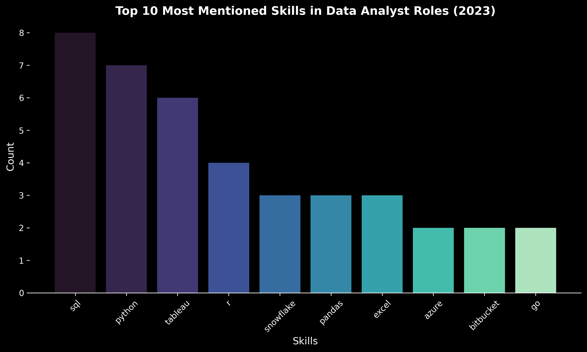
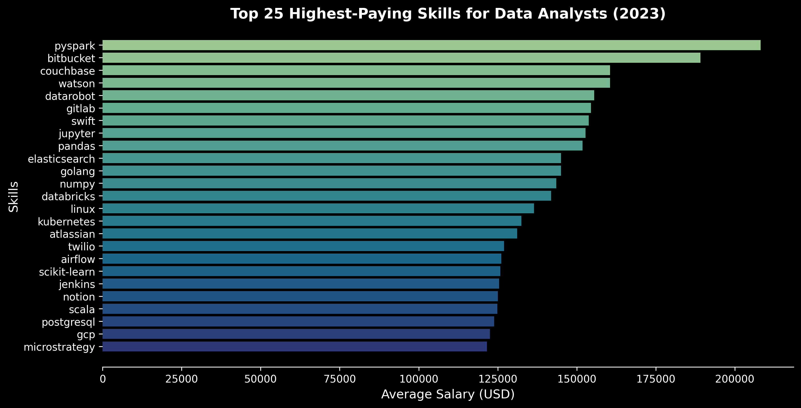

# Introduction
# Introduction  
📊 Exploring the data job market! This project delves into 💰 the highest-paying roles, 🔥 the most sought-after skills, and 📈 the intersection of demand and salary in data analytics.  

🔍 Want to see the SQL queries? Find them here: [project_sql folder](/project_sql/)


# Background  

This project was created to better understand the data analyst job market, identifying the highest-paying and most in-demand skills. The goal is to simplify the job search process by highlighting key trends.  

The dataset comes from Luke Barousse's [SQL Course](https://lukebarousse.com/sql), offering valuable insights into job titles, salaries, locations, and essential skills.  


### The questions I wanted to answer through my SQL queries were:

1. What are the top-paying data analyst jobs?
2. What skills are required for these top-paying jobs?
3. What skills are most in demand for data analysts?
4. Which skills are associated with higher salaries?
5. What are the most optimal skills to learn?

# Tools Used  

To explore the data analyst job market, I leveraged several essential tools:  

- **SQL**: The core of my analysis, enabling me to query data and extract meaningful insights.  
- **PostgreSQL**: A robust database management system, ideal for handling job posting data.  
- **Visual Studio Code**: My preferred environment for writing and executing SQL queries.  
- **Git & GitHub**: Crucial for version control, collaboration, and sharing my SQL scripts and findings.  

# The Analysis  

Each SQL query in this project was designed to answer key questions about the data analyst job market. Here’s the structured approach I followed:  


### 1. Top Paying Data Analyst Jobs

To uncover the most lucrative opportunities, I filtered data analyst roles by average annual salary and location, prioritizing remote positions. This query pinpoints the top-paying opportunities in the field.  


```sql
SELECT
    job_id,
    job_title,
    job_location,
    job_schedule_type,
    salary_year_avg,
    job_posted_date,
    name AS company_name
FROM
    job_postings_fact
LEFT JOIN company_dim ON job_postings_fact.company_id = company_dim.company_id
WHERE
    job_title_short = 'Data Analyst'
    AND job_location = 'Anywhere'
    AND salary_year_avg IS NOT NULL
ORDER BY
    salary_year_avg DESC
LIMIT 10;
```
### Key Insights from the Top Data Analyst Jobs in 2023:

- ***Wide Salary Range:*** Salaries among the top 10 data analyst roles vary significantly, ranging from $184,000 to $650,000.
- ***Diverse Employers:*** Companies like SmartAsset, Meta, and AT&T stand out for offering competitive salaries, reflecting demand across multiple industries.
- ***Varied Job Titles:*** Roles span from Data Analyst to Director of Analytics, showcasing the range of specializations within data analytics.




*Bar graph visualizing the salary for the top 10 salaries for data analysts; ChatGPT generated this graph from my SQL query results*

### 2. Skills for Top-Paying Jobs  

To identify the key skills required for the highest-paying roles, I joined job postings with skill data. This provides a clear view of what employers prioritize when offering top-tier salaries.  

```sql
WITH top_paying_jobs AS (
    SELECT
        job_id,
        job_title,
        salary_year_avg,
        name AS company_name
    FROM
        job_postings_fact
    LEFT JOIN company_dim ON job_postings_fact.company_id = company_dim.company_id
    WHERE
        job_title_short = 'Data Analyst'
        AND job_location = 'Anywhere'
        AND salary_year_avg IS NOT NULL
    ORDER BY
        salary_year_avg DESC
    LIMIT 10
)

SELECT
    top_paying_jobs.*,
    skills
FROM top_paying_jobs
INNER JOIN skills_job_dim ON top_paying_jobs.job_id = skills_job_dim.job_id
INNER JOIN skills_dim ON skills_job_dim.skill_id = skills_dim.skill_id
ORDER BY
    salary_year_avg DESC
```

### Key Insights on Skills for High-Paying Data Analyst Roles in 2023:

- ***SQL*** leads the way, appearing in 8 out of the 10 highest-paying jobs.
- ***Python*** follows closely, being mentioned in 7 of these roles.
- ***Tableau*** is another highly sought-after skill, showing up in 6 job postings.
- Other valuable skills include ***R***, ***Snowflake***, ***Pandas***, and ***Excel***, each with varying levels of demand.



### 3. In-Demand Skills for Data Analysts  

To pinpoint the most sought-after skills in the job market, I ran this query to identify the skills most frequently mentioned in data analyst job postings.  


```sql
SELECT
    skills,
    COUNT(skills_job_dim.skill_id) AS demand_count
FROM job_postings_fact
INNER JOIN skills_job_dim ON job_postings_fact.job_id = skills_job_dim.job_id
INNER JOIN skills_dim ON skills_job_dim.skill_id = skills_dim.skill_id
WHERE
    job_title_short = 'Data Analyst' AND
    job_work_from_home = TRUE
GROUP BY
    skills
ORDER BY
    demand_count DESC
limit 5;
```

### Key Insights on the Most In-Demand Skills for Data Analysts in 2023:

- ***SQL*** and ***Excel*** remain essential, highlighting the importance of strong foundational skills in data processing and spreadsheet management.
- ***Programming & Visualization Tools*** like ***Python***, ***Tableau***, and ***Power BI*** are crucial, reinforcing the growing need for technical proficiency in data storytelling and decision-making.

| **Skill** | **Demand Count** |
|:---------:|:----------------:|
|    SQL    |      7,291       |
|   Excel   |      4,611       |
|  Python   |      4,330       |
| Tableau   |      3,745       |
| Power BI  |      2,609       |


*Table of the demand for the top 5 skills in data analyst job postings*

### 4. Salary Insights by Skill
Analyzing average salaries associated with various skills shows which ones are the most lucrative.

```sql
SELECT
    skills,
    ROUND(AVG(salary_year_avg), 0) AS avg_salary
FROM job_postings_fact
INNER JOIN skills_job_dim ON job_postings_fact.job_id = skills_job_dim.job_id
INNER JOIN skills_dim ON skills_job_dim.skill_id = skills_dim.skill_id
WHERE
    job_title_short = 'Data Analyst'
    AND job_work_from_home = TRUE
    AND salary_year_avg IS NOT NULL
GROUP BY
    skills
ORDER BY
    avg_salary DESC
limit 25
```

| Skill           | Avg. Salary (USD) |
|----------------|------------------|
| PySpark        | 208,172          |
| Bitbucket      | 189,155          |
| Couchbase      | 160,515          |
| Watson         | 160,515          |
| DataRobot      | 155,486          |
| GitLab         | 154,500          |
| Swift          | 153,750          |
| Jupyter        | 152,777          |
| Pandas         | 151,821          |
| Elasticsearch  | 145,000          |
| Golang         | 145,000          |
| NumPy          | 143,513          |
| Databricks     | 141,907          |
| Linux         | 136,508          |
| Kubernetes     | 132,500          |
| Atlassian      | 131,162          |
| Twilio        | 127,000          |
| Airflow       | 126,103          |
| Scikit-learn   | 125,781          |
| Jenkins        | 125,436          |
| Notion         | 125,000          |
| Scala         | 124,903          |
| PostgreSQL     | 123,879          |
| GCP            | 122,500          |
| MicroStrategy  | 121,619          |

## Key Takeaways from the Top 25 Highest-Paying Skills for Data Analysts

### Dominance of Big Data & Cloud Technologies
- **PySpark** ($208K) and **Databricks** ($141K) highlight the high demand for distributed computing and big data processing.
- **GCP** ($122K) and **Kubernetes** ($132K) underline the importance of cloud computing and containerization skills.

### Value of DevOps & Version Control
- **Bitbucket** ($189K), **GitLab** ($154K), and **Jenkins** ($125K) stress the significance of version control and CI/CD in data workflows.

### AI & Machine Learning Salary Boosts
- **DataRobot** ($155K) and **Scikit-learn** ($125K) suggest that ML-related skills come with a premium.
- **Watson** ($160K) indicates a demand for AI-related tools.

### Rewarding Programming Beyond Python
- **Swift** ($153K) and **Golang** ($145K) demonstrate that non-traditional data analysis languages can still command high salaries.
- **Scala** ($124K) is widely used in data engineering and big data processing.

### High Pay for SQL Variants & NoSQL Databases
- **Couchbase** ($160K) and **PostgreSQL** ($123K) highlight the importance of database expertise.
- **Elasticsearch** ($145K) is vital for large-scale search and analytics.

### Importance of Data Engineering & Workflow Automation
- **Apache Airflow** ($126K) is crucial for data pipeline automation.
- **Jupyter** ($152K) and **Pandas** ($151K) prove that traditional data manipulation tools remain valuable.


### 5. Most Optimal Skills to Learn
Combining insights from demand and salary data, this query aimed to pinpoint skills that are both in high demand and have high salaries, offering a strategic focus for skill 


```sql
WITH skills_demand AS (
    SELECT
        skills_dim.skill_id,
        skills_dim.skills,
        COUNT(skills_job_dim.skill_id) AS demand_count
    FROM job_postings_fact
    INNER JOIN skills_job_dim ON job_postings_fact.job_id = skills_job_dim.job_id
    INNER JOIN skills_dim ON skills_job_dim.skill_id = skills_dim.skill_id
    WHERE
        job_title_short = 'Data Analyst'
        AND salary_year_avg IS NOT NULL
        AND job_work_from_home = TRUE
    GROUP BY
        skills_dim.skill_id
), average_salary AS(
    SELECT
        skills_job_dim.skill_id,
        ROUND(AVG(salary_year_avg), 0) AS avg_salary
    FROM job_postings_fact
    INNER JOIN skills_job_dim ON job_postings_fact.job_id = skills_job_dim.job_id
    INNER JOIN skills_dim ON skills_job_dim.skill_id = skills_dim.skill_id
    WHERE
        job_title_short = 'Data Analyst'
        AND job_work_from_home = TRUE
        AND salary_year_avg IS NOT NULL
    GROUP BY
        skills_job_dim.skill_id
)

SELECT
    skills_demand.skill_id,
    skills_demand.skills,
    demand_count,
    avg_salary
FROM
    skills_demand
INNER JOIN average_salary ON skills_demand.skill_id = average_salary.skill_id
WHERE
    demand_count > 10
ORDER BY
    avg_salary DESC,
    demand_count DESC    
LIMIT 25;

```


| Skill ID | Skill        | Demand Count | Avg. Salary (USD) |
|----------|-------------|--------------|--------------------|
| 8        | Go          | 27           | 115,320           |
| 234      | Confluence  | 11           | 114,210           |
| 97       | Hadoop      | 22           | 113,193           |
| 80       | Snowflake   | 37           | 112,948           |
| 74       | Azure       | 34           | 111,225           |
| 77       | BigQuery    | 13           | 109,654           |
| 76       | AWS         | 32           | 108,317           |
| 4        | Java        | 17           | 106,906           |
| 194      | SSIS        | 12           | 106,683           |
| 233      | Jira        | 20           | 104,918           |
| 79       | Oracle      | 37           | 104,534           |
| 185      | Looker      | 49           | 103,795           |
| 2        | NoSQL       | 13           | 101,414           |
| 1        | Python      | 236          | 101,397           |
| 5        | R           | 148          | 100,499           |
| 78       | Redshift    | 16           | 99,936            |
| 187      | Qlik        | 13           | 99,631            |
| 182      | Tableau     | 230          | 99,288            |
| 197      | SSRS        | 14           | 99,171            |
| 92       | Spark       | 13           | 99,077            |
| 13       | C++         | 11           | 98,958            |
| 186      | SAS         | 63           | 98,902            |
| 7        | SAS         | 63           | 98,902            |
| 61       | SQL Server  | 35           | 97,786            |
| 9        | JavaScript  | 20           | 97,587            |

*Table of the most optimal skills for data analyst sorted by salary*

*Table of the most optimal skills for data analysts sorted by salary*

Here's a breakdown of the most optimal skills for Data Analysts in 2023:

**High-Demand Programming Languages:** Python and R stand out for their high demand, with demand counts of 236 and 148 respectively. Despite their high demand, their average salaries are around $101,397 for Python and $100,499 for R, indicating that proficiency in these languages is highly valued but also widely available.

**Cloud Tools and Technologies:** Skills in specialized technologies such as Snowflake, Azure, AWS, and BigQuery show significant demand with relatively high average salaries, pointing towards the growing importance of cloud platforms and big data technologies in data analysis.

**Business Intelligence and Visualization Tools:** Tableau and Looker, with demand counts of 230 and 49 respectively, and average salaries around $99,288 and $103,795, highlight the critical role of data visualization and business intelligence in deriving actionable insights from data.

**Database Technologies:** The demand for skills in traditional and NoSQL databases (Oracle, SQL Server, NoSQL) with average salaries ranging from $97,786 to $104,534, reflects the enduring need for data storage, retrieval, and management expertise.


# What I Learned
Throughout this adventure, I've turbocharged my SQL toolkit with some serious firepower:

Throughout this journey, I've supercharged my SQL toolkit with some impressive abilities:

🧩 Intricate Query Mastery: Conquered advanced SQL techniques, seamlessly merging tables and expertly wielding WITH clauses for sophisticated temp table operations. 📊 Data Summarization: Became well-versed with GROUP BY, transforming aggregate functions like COUNT() and AVG() into my go-to data-summarizing allies. 💡 Analytical Brilliance: Enhanced my real-world problem-solving prowess, converting questions into actionable, insightful SQL queries.


# Conclusions

## Insights

From the analysis, several general insights emerged:

1. **Top-Paying Data Analyst Jobs**: The highest-paying jobs for data analysts that allow remote work offer a wide range of salaries, the highest at $650,000!
2. **Skills for Top-Paying Jobs**: High-paying data analyst jobs require advanced proficiency in SQL, suggesting it’s a critical skill for earning a top salary.
3. **Most In-Demand Skills**: SQL is also the most demanded skill in the data analyst job market, thus making it essential for job seekers.
4. **Skills with Higher Salaries**: Specialized skills, such as SVN and Solidity, are associated with the highest average salaries, indicating a premium on niche expertise.
5. **Optimal Skills for Job Market Value**: SQL leads in demand and offers a high average salary, positioning it as one of the most optimal skills for data analysts to learn to maximize their market value.

## Closing Thoughts

This project enhanced my SQL skills and provided valuable insights into the data analyst job market. The findings from the analysis serve as a guide to prioritizing skill development and job search efforts. Aspiring data analysts can better position themselves in a competitive job market by focusing on high-demand, high-salary skills. This exploration highlights the importance of continuous learning and adaptation to emerging trends in the field of data analytics.
